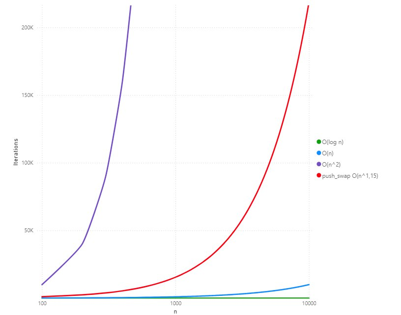

# push_swap

## Overview
The `push_swap` project is a sorting algorithm exercise designed to sort a stack of integers with the least number of moves. The program uses a predefined set of operations to manipulate two stacks (`a` and `b`) and generates a sequence of instructions to sort the data.

---

## Performance

**O(n^1.15)** for large inputs.




## Features
- **Sorting Operations**: Implements operations like `sa`, `pb`, `ra`, `rra`, etc., to manipulate the stacks.
- **Error Management**: Handles invalid inputs, including:
  - Non-numeric characters
  - Out-of-range integers
  - Duplicate numbers
  - Incorrectly formatted arguments
- **Optimized Sorting**: Uses indexing and the Radix Sort algorithm to efficiently sort large stacks.

---

## Data Structure
### **Circular Doubly Linked List**
The project uses a **circular doubly linked list** to represent each stack (`a` and `b`). This structure allows efficient manipulation of stack elements for operations such as rotation, swapping, and pushing.

1. **Node (`t_node`)**:
   - Each node represents an element in the stack.
   - Fields:
     - `value`: The integer value of the node.
     - `index`: The computed index used during sorting.
     - `next`: Pointer to the next node.
     - `prev`: Pointer to the previous node.

2. **Stack (`t_stack`)**:
   - Each stack is represented by a structure containing:
     - `head`: A pointer to the first node in the stack.
     - `size`: The total number of elements in the stack.

3. **Initialization**:
   - The stack is populated using the `fill_up_stack` function, which:
     - Creates a node for each integer in the input array using `create_node`.
     - Inserts the node into the circular linked list using `insert_num`.
     - Ensures the list maintains its circular structure (last node points to the first, and vice versa).

4. **Advantages**:
   - **Efficiency**: Operations like rotation (`ra`/`rra`) and swapping (`sa`) can be performed in constant time.
   - **Flexibility**: Allows dynamic resizing of stacks without reallocating memory.
   - **Simplicity**: Circular links eliminate the need for special handling of edge cases during rotations.

---

## Usage
### Compilation
Use the provided `Makefile` to compile the project:
```bash
make
```

### Running the Program
Run the `push_swap` executable with a list of integers as arguments:
```bash
./push_swap <list_of_integers>
```

### Example
```bash
./push_swap 2 1 3 6 5 8
# Output:
sa
pb
pb
pb
sa
pa
pa
pa
```

### Random Number Generator
https://www.calculatorsoup.com/calculators/statistics/random-number-generator.php

### Error Handling
The program displays an error for invalid inputs:
```bash
./push_swap 0 one 2 3
# Output:
Error
```
---

## Tests
```bash
chmod +x run_tests.sh
./run_tests.sh
```

If you have 'checker_linux' provided by School 42.
```bash
chmod +x run_tests.sh
./run_tests_checker.sh
```
### Memory leak tests
Uncomment "CC      = gcc -fsanitize=address -g -O1" in Makefile, rebuld the program, and run tests.
```bash
make re
./run_tests.sh
```
---

## Algorithm
### **Indexing for Optimization**
To improve performance, the algorithm assigns an **index** to each value in the stack based on its relative position. This transforms the problem from comparing raw values to working with sequential indices, simplifying and accelerating the sorting process.

- **How Indexing Works**:
  - Each node in stack `a` is compared with every other node.
  - The index is incremented for each node whose value is smaller.
  - This ensures the smallest value has an index of `0`, the next smallest has an index of `1`, and so on.

- **Advantages**:
  - Reduces the complexity of sorting large values.
  - Optimized bitwise operations are used during sorting (via the Radix Sort algorithm).

---

### **Radix Sort Algorithm**
The primary sorting algorithm implemented is a variation of **Radix Sort**, which processes integers' binary representations from the least significant bit (LSB) to the most significant bit (MSB). It leverages the assigned indices for faster comparisons.

1. **Radix Sort for Stack `a` (`radix_sort_a`)**:
   - Iterates through all elements in stack `a`.
   - If the bit at the current position (`shift`) is `0`, the element is pushed to stack `b` using the `pb` operation.
   - If the bit is `1`, the element is rotated within stack `a` using the `ra` operation.

2. **Radix Sort for Stack `b` (`radix_sort_b`)**:
   - Iterates through all elements in stack `b`.
   - If the bit at the current position (`shift`) is `0`, the element is pushed back to stack `a` using the `pa` operation.
   - If the bit is `1`, the element is rotated within stack `b` using the `rb` operation.

3. **Overall Radix Sort Process (`radix_sort`)**:
   - Alternates between sorting stack `a` and stack `b` for each bit position (`shift`).
   - The process repeats until the stack `a` is completely sorted, as verified by the `is_sorted` function.

### **Small Stack Sorting**
For smaller stacks, specific sorting methods are implemented:
- **2 elements**: Directly swaps elements using `sa` if needed.
- **3 elements**: Uses minimal instructions to achieve the sorted order.
- **4-5 elements**: Leverages `pb` and `pa` operations to reduce the stack size, followed by sorting and reintegrating elements.

---

## Test Outputs
### Error Management Tests
| **Input**                      | **Output**        |
|--------------------------------|-------------------|
| Consecutive signs: `'--'`      | Error             |
| Out of range `< INT_MIN`       | Error             |
| Leading zeros: `'-01'`         | Error             |
| Plus with space: `'+ 42'`      | Error             |
| Single sign: `'-'`             | Error             |
| Duplicate numbers              | Error             |
| Consecutive signs: `'++'`      | Error             |
| Non-numeric: `'a b c'`         | Error             |
| Non-numeric: `'!2 1 0'`        | Error             |
| Leading zeros: `'+01'`         | Error             |
| Leading zeros: `'01'`          | Error             |
| Invalid leading zeros: `'0123'`| Error             |
| Out of range `> INT_MAX`       | Error             |
| Multiple signs: `'--1'`        | Error             |
| Invalid mixed leading zeros: `'7 66 07'` | Error |
| Multiple signs: `'++1'`        | Error             |
| Single sign: `'+'`             | Error             |

---

### Identity and Simple Tests
| **Input**                      | **Checker Result** | **Number of Moves** |
|--------------------------------|--------------------|---------------------|
| 6 values + INT_MAX and INT_MIN | OK                 | 29                  |
| 2 random values                | OK                 | 1                   |
| 3 random values                | OK                 | 2                   |
| 5 random values                | OK                 | 6                   |

---

### Larger Random Tests
| **Input**                      | **Checker Result** | **Number of Moves** |
|--------------------------------|--------------------|---------------------|
| 100 random distinct values     | OK                 | 1084                |
| 500 random distinct values     | OK                 | 6784                |
| 1000 random distinct values    | OK                 | 15068               |
| 2000 random distinct values    | OK                 | 33136               |

---

## Notes
- **Memory Management**: All dynamically allocated memory is properly freed to avoid leaks.
- **Norm Compliance**: The project adheres to the coding style required by Hive Helsinki.

---

